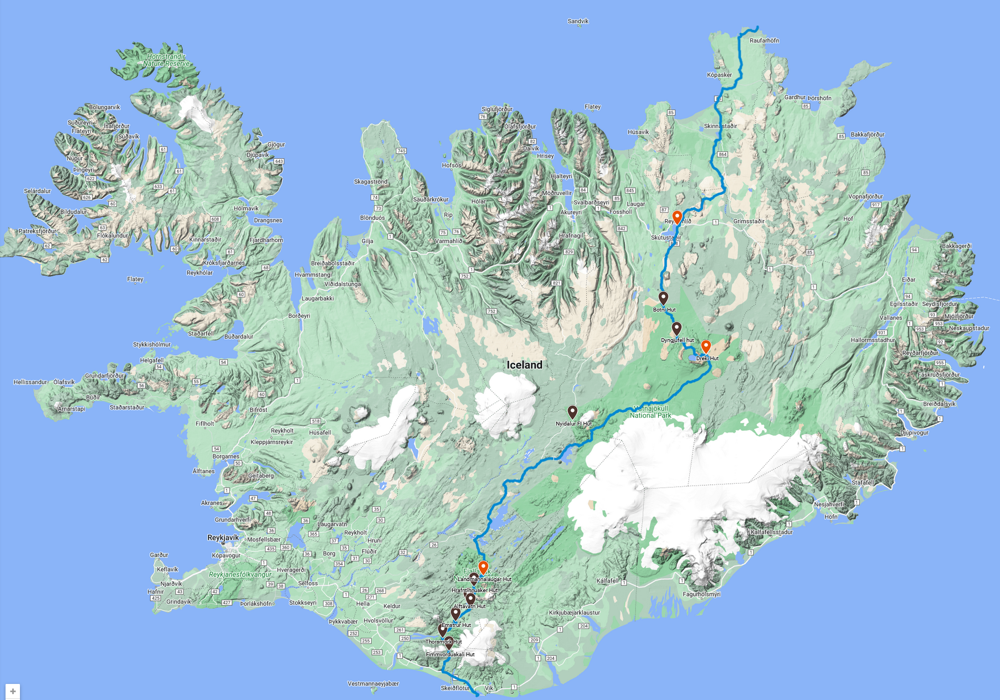

# Route and duration
- Roughly 600 km (347 miles)
- 3 weeks (20 days) of hiking.
- Add a few extra days for preparation in town and for after the hike
- Assuming 30 days in the country (20 on trail, 10 days off trail)
- Northern Terminus: Northernmost lighthouse of Hraunhafnartangi
- Southern Terminus: Southernmost lighthouse, Dyrhólaey.

## Water Carry areas
Between Askja and Kistufell Hut is dry, about 1 day of water carry.

## Highlights
1. Northernmost lighthouse Hraunhafnartangi
2. Asbygri Canyon
3. Dettifoss: highest volume waterfall in Europe
4. Selfoss
5. Lake Myvatn and Reykjahlíð: Myvatn Geothermal Area and Myvatn Nature Baths are here (food drop)
6. Odadahraun lava field
7. Dyngjufjoll Mountains
8. Askja Caldera
9. Oskjuvatn: Deepest lake in Iceland
10. Vatnajokull galcier
11. Laugavegur Trail
12. Landmannalaugar hot springs
13. Skogafoss
14. Vik
15. Black Sands Beach
16. Southernmost lighthouse Dyrhólaey
17. [Goldfish pond](https://guidetoiceland.is/travel-iceland/drive/geothermal-goldfish-pond-1) at Husavík 

# Before leaving
- Register hike on [Safe Travel IS](safetravel.is)
- Install the 112 Iceland App (For communication in case of an emergency)
- Get an eSIM Cheaper option from [Nomad](https://www.getnomad.app/iceland-eSIM?rfsn=7432846.e5d9a4) no more than 30 days in advance. Activates on first use

## First Arrival
1. Travel to Capital Reykjavik BSI Bus Stop
2. Visit Reykjavik Excursions and pay for one package to be shipped to Landmannalaugar
3. Travel to Reykjavik Campground and setup camp
4. Pay for Luggage Storage and drop off there (OPTIONAL if any, cheaper long term rate on the campground 5800 ISK per week)
5. Buy Mál og menning map from Penninn Eymundsson bookstore. (OPTIONAL, already have paper map and it may be current)
6. Visit the ICE-SAR office in the center of Reykjavik to let them know of your plans and ask for current conditions (when it is open M-F 8-4)
7. Visit grocery story and purchase 3 weeks worth of food. Bonus is the cheapest store, its walking distance from the Reykjavik Campground. Ask the store if they have some cardboard boxes that we can use for the food drop
8. Organize food into 1 food drops for 4 days. Food in backpack for 5 days
9. Check the [weather](https://en.vedur.is/) and [road conditions](https://www.road.is/)

## Getting to the Northern Terminus
[Public Straeto Bus Service](https://straeto.is/)
See [map](https://straeto.is/media/2022/08/str-heildarkort-samgo-CC-88ngur-vagnar.png)
- #55 public bus from Kefvlavik to Reykavik - 1.5 hour
- #57 public bus from Reykiavik to Akureyri - 6 hour
- #79 public bus trip to Husavik - 1.5 hour
- Last 90 miles hitchhiking
  
## Getting from the southern terminus back to Reykjavik
- #51 Bus from Vik to Reykjavik

## Navigation
1:425,000 Reise Know How map
Road Map: https://vegasja.vegagerdin.is/eng/
All around map: https://map.is/base/@630811,670553,z6,0
http://vefsja.iskort.is/
Bus plan: http://www.publictransport.is/
Route planner: https://straeto.is/en/route-planner/

## Food Drops
Purchase the food drop service from Reykjavik Excursions. This is a 2000 ISK Service which you can drop the box off from the Campsite Hostel (Reykjavik Camping) at 6:30 AM
Package the food either in a box or bag and label with your name and phone number

1. Reykjahlíð -- Hide somewhere or skip this food drop and just buy locally from grocery stores (Krambúðin Reykjahlíð, Vínbúðin)
2. Dreki hut -- have bus driver take your package. Call the hut and ask them to remove the package from the bus and hold. Or just skip this food drop and carry through (10 day max carry)
3. Nyidalur -- have bus driver take your package to the hut. Call the hut and ask them to remove the package from the bus and hold. *Skip this drop, carry through 7 days from Dreki to Landmannalagur* 
4. Landmannalaugar -- have bus driver take your package to the hut. Call the hut and ask them to remove the package from the bus and hold

### Preferred - Alternative Food Drops
1. Myvatn -- 5 day carry from Northern Terminus to Myvatn, resupply in the grocery store in town
2. Dreki hut -- 3 day carry from Myvatn to Dreki have bus driver take your package. Call the hut and ask them to remove the package from the bus and hold -- [Myvatn Tours](https://myvatntours.is/)
3. Landmannalaugar -- 7 day carry from Dreki to Landannalaugar have bus driver take your package to the hut. Call the hut and ask them to remove the package from the bus and hold -- [Reyjkavik Excursions](https://www.re.is/highland-bus/)

# Itinerary
- Section 1: Hraunhafnartangi to Asbyrgi (2.5 days)
  - Northern Lighthouse to Asbyrgi Canyon.
  - This is remote and has a road walk
  - Asbyrgi campground is available and paid for, or pass by for a wild camp
  - N1 Gas station near Asbygri, can get some small resupply and hot food there. May be expensive
  - No huts
- Section 2: Asbyrgi to Lake Myvatn (2.5 days)
  - Passes by Dettifoss and Selfoss waterfalls.
  - No huts
- Section 3: Myvatn to Dreki (Askja)(3 days)
  - Passes by 2 huts [Botni](https://www.fi.is/en/mountain-huts/all-mountain-huts/botni) and [Dyngjufell](https://www.fi.is/en/mountain-huts/all-mountain-huts/dyngjufell)
  - These are primitive huts that can just be used for shelter and cooking
  - Follows part of the [Askja Trail](https://www.fi.is/en/hiking-trails/trails/oskjuvegur)
- Section 4: Dreki to Landmannalaugar (7 days)
  - This is a remote section, has a long water carry
  - Follows F-roads for some of it
  - Passes by 2 huts, [Dreki](https://www.fi.is/en/mountain-huts/all-mountain-huts/dreki) at the start and [Nýidalur](https://www.fi.is/en/mountain-huts/all-mountain-huts/nyidalur)
  - Can camp at these huts, but it will cost money. Can pass the huts and do a wild camp
- Section 5: Landmannalaugar to Dyrhólaey (4 days)
  - Follows 2 trails, the [Laugavegur](https://www.fi.is/en/hiking-trails/trails/laugavegur) and [Fimmvörðuháls](https://www.fi.is/en/hiking-trails/trails/fimmvorduhals) trails.
  - This will be the protected area where wild camping is not allowed, must stay at developed campgrounds. Toilets and showers are available at these grounds. Electricity is not available.

Total: 20 days

# Costs
## Transport
### Airfare
* Round trip from DFW to Reykjavík ~ $570
* Round trip from Frankfurt to Reykjavík ~ $365

### Bus Travel
* Local bus in Reykjavík: 630 ISK -- $4.67 (Optional if needed)
* #55 bus Airport to Reykjavík : 2280 ISK -- $16.91 X2
* #57 bus Reykjavík to Akureyri 12.540 ISK (570 x 22 zones) -- $93.01
* #79 bus from Akureyri to Húsavík  (570 X 6 zones) 3.420 ISK -- $25.37
* #51 bus from Vík to Reykjavík  (570 x 14 zones) 7.980 ISK -- $59.19
* Total: $211.39

* different itinerary https://straeto.is/en/route-planner/search/c29283c185cb/0

## Lodging

### Hostels
Optional, Camping is a cheaper option which is available in all locations. Reykjavik camping is just $25 a night and includes showers, cooking area etc. Lodging tax at campsites is 300 ISK and 600 ISK for hostels.

### Camping
Reservations are not needed for these campgrounds. Some campgrounds could be skipped an opt instead for a wild camp (Vogar and Dreki). This is not advised in the Landmannalaugar area as its protected lands. There is a 300 ISK lodging tax.
* Reykjahlíð Vogar Campground - 2250 ISK - $16.48
* Reykjahlíð Camping area Hlíð ferðaþjónusta (prices TODO)
* Landmannalaugar Campground - 2500 ISK - $18.31
* Hvanngil Campground 2800 ISK - $20.51
* Thorsmork Langidalur Campground 2800 ISK - $20.51
* Skogar Campground 1500 ISK - $10.98
* Vik Campground 1950 ISK - $14.28
* Reykjavik Campground 3303 ISK - $24.19 (OPTIONAL/Cheap place to stay in the capital for the extra days before and after hike w/ showers laundry etc. )
* SubTotal: $101.07
* Lodging Tax: 6x300ISK 1800 ISK = $13.19
* Total $114.26

## Food
### Food Drops
Note: There may be an additional fee from the hut to hold these packages 
* Reykjavik Excursions Baggage Service 2000 ISK - $14.64 (email to fjallafangehf@gmail.com, size 55x40x20 cm, maximum weight: 10 kg)
* Myvatn Tours -- TODO Contact the company to see if a box can be sent from Reykjahlíð to Dreki hut

### Groceries
TODO

### Dining
* Reykjahlíð Mylla Restaurant

## Misc
### Luggage Storage
* Reyjkavik Campground has a discounted long term rate 5800 ISK per week x4 weeks 23200 ISK =  $170.91
### SIM
* eSIM roughly $12 from Nomad for data only

## Total
### Rough Estimate minus the cost of Groceries
* Dan - $1340.29 + (10 days lodging x $25 + $21.98 tax) = $1612.27
* Jia - $640.29 + (10 days lodging x $25 + $21.98 tax) = $1012.27

# References
* https://lukaszsupergan.com/crossing-iceland-traverse-east-west-food-supplies-deposits/
* https://thetrek.co/the-iceland-traverse-north-to-south/
* https://viajarapie.info/en/trips/iceland-north-to-south/
* http://www.deadbad.com/blog/index.php?thingindex=15&submenu=tripovervie
* https://www.youtube.com/watch?v=ON3oMFzdlzU
* https://straeto.is/media/2023/10/prices-single-fare-north-and-northeast-iceland-okt.pdf
* [Camping in the Landmannalaugar area](https://www.fi.is/en/mountain-huts/terms-and-conditions)
* [Camping in the Myvatn area](https://www.vogartravelservice.com/camping)
* https://www.reykjavikcampsite.is/tourdesk-2/
* https://www.re.is/tour/landmannalaugar-iceland-on-your-own/
* [FI Mountain Huts](https://www.fi.is/en/mountain-huts/map-of-mountain-huts)
* [Reykjavik Excursions Baggage Service FAQ] https://www.re.is/faq/
